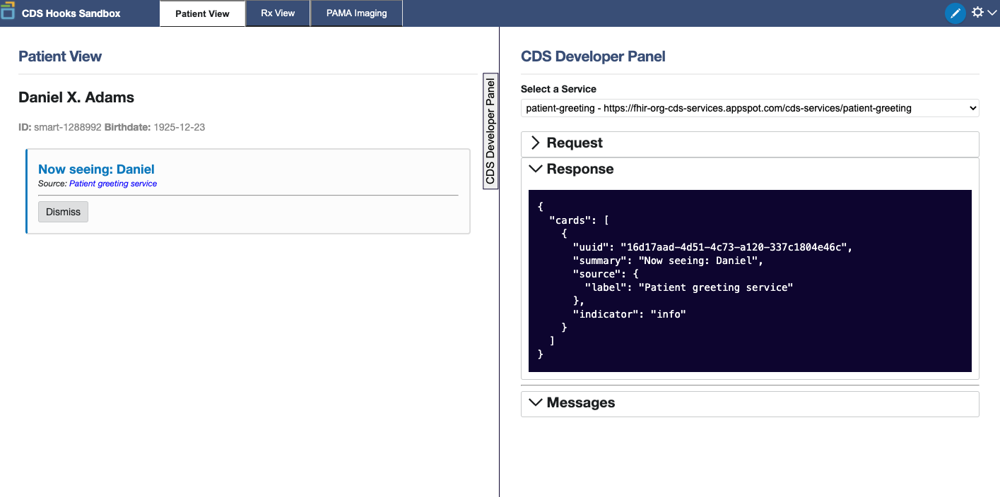
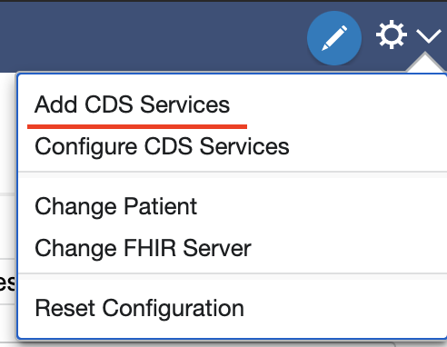
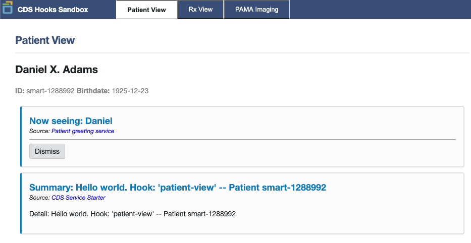

# Node CDS Service Starter

This is a starter project for a CDS Service. It is designed to reduce the development time
for developers by solving the boring parts for them.

## Getting started

### Install

```
yarn install
```

### Start Nodemon

```
yarn develop
```

Or: Just node

```
yarn start
```

### Test with CDS Hooks Sandbox



CDS Hooks Sandbox is a fantastic tool that simulates calls to your CDS Service, where you can then return different **Cards**.
Out of the box, **node-cds-service-starter** returns an **Information** card. Read about the different types of card on [CDS Hooks](https://cds-hooks.org/).

#### Register Your Service

Register your service by selected "Add CDS Service" in the upper right.



Add your discovery endpoint where the CDS Hooks Sandbox can find the hooks you
would like to subscribe to. If you are developing locally, then you would put **http://localhost:3000/cds-services**

We can now see in our Sandbox that the default information card is being displayed.



## Default Card

There is one information card that can be used as an example already supplied in this project.

```json
{
  "cards": [
    {
      "summary": "Summary: Hello world. Hook: 'patient-view' -- Patient smart-1288992",
      "detail": "Detail: Hello world. Hook: 'patient-view' -- Patient smart-1288992",
      "source": {
        "label": "CDS Service Starter",
        "url": "https://example.com"
      },
      "indicator": "info"
    }
  ]
}
```
